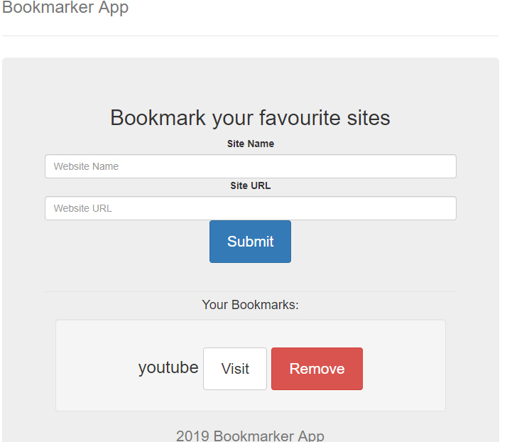

# Bookmarker Application

A bookmarker application, using mainly HTML and javascript. Users can add websites as bookmarks, remove bookmarks, and visit bookmarks. This application uses localStorage to store the bookmarks.

### Installation

Just simply download index.html and open with Chrome.

### Useful links

JQuery script: https://code.jquery.com/

Style and layout: Jumbotron heading - https://getbootstrap.com/docs/3.3/examples/jumbotron-narrow/

### Demo

### Author

Taha Kazi

